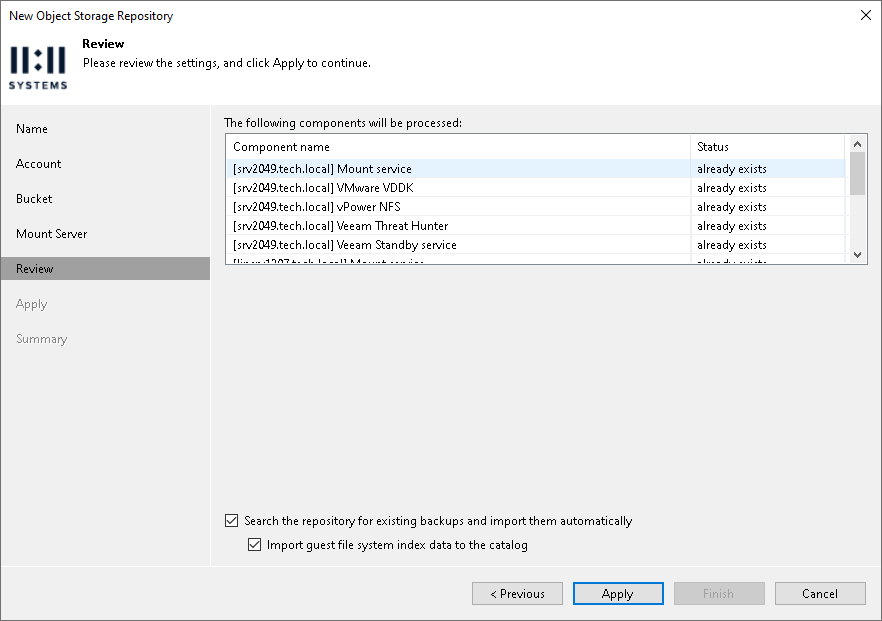

# Step 6. Review Components

In this article

At the Review step of the wizard, review what components will be processed on the mount server server and their status.

If the backup repository contains backups, select the Search the repository for existing backups and import them automatically check box. Veeam Backup & Replication will scan the backup repository to detect existing backup files and display them in the Veeam Backup & Replication console under the Backups > Object Storage (Imported) node.

If the backup repository contains guest file system index files, select the Import guest file system index data to the catalog check box. Veeam Backup & Replication will import index files together with backup files, and you will be able to search for guest OS files inside imported backups. For more information, see the [Guest OS File Restore](https://helpcenter.veeam.com/docs/vbr/em/searching_restoring_vm_guest_files.html?ver=13) section of the Veeam Backup Enterprise Manager Guide.

Page updated 8/8/2025

Page content applies to build 13.0.1.1071
