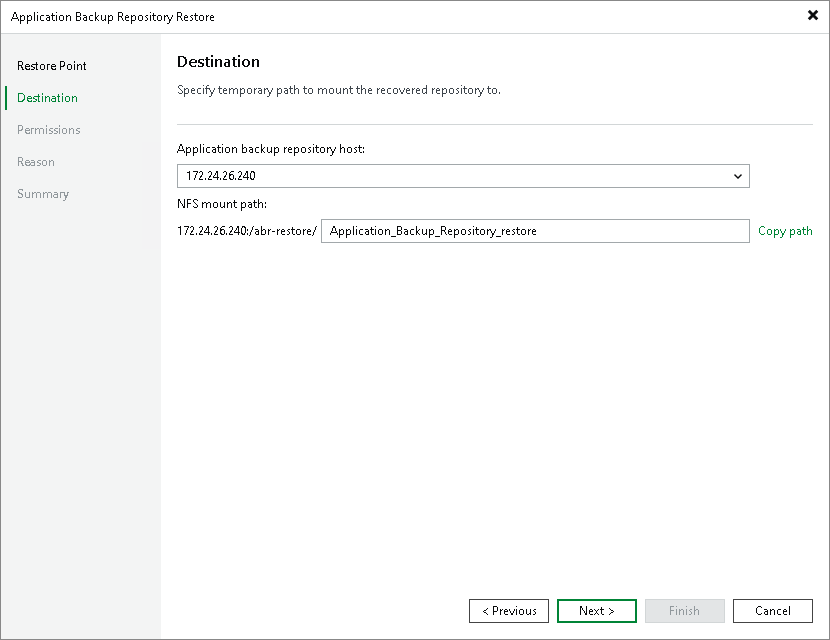

# Step 3. Specify Destination

At the Destination step of the wizard, select where to mount the temporary NFS share and specify the mount path:

1. From the Application backup repository host list, select an application backup repository where the temporary NFS share will be mounted. You can choose any host with the application backup repository role assigned.
2. In the NFS mount path field, specify the mount path for the temporary NFS share.
3. Click Copy path to save the full mount path to your clipboard and use it with your NFS client to access the temporary NFS share where the data is exported to.

Page updated 2026-06-19

