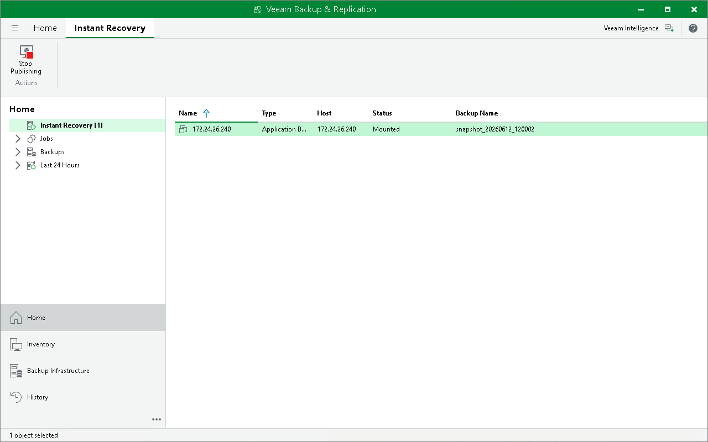

# Step 7. Finalize Application Backup Repository Restore

After the repository data has been exported to a temporary NFS share, you must finalize the recovery process. For this, access the temporary NFS share using the mount path you provided at the Destination step of the wizard to browse the data.

When the data recovery is done, and the snapshot export can be stopped, you can stop publishing the exported data. This will dismount the temporary NFS share that you specified as the destination for recovery. Note that all changes made in the temporary NFS folder during the recovery process will be lost.

To stop exporting the application backup repository snapshot:

1. Open the Home view.
2. In the inventory pane, select the Instant Recovery node.
3. In the working area, right-click the application backup repository host and select Stop publishing. Alternatively, you can click Stop Publishing on the ribbon.

Page updated 2026-06-23

