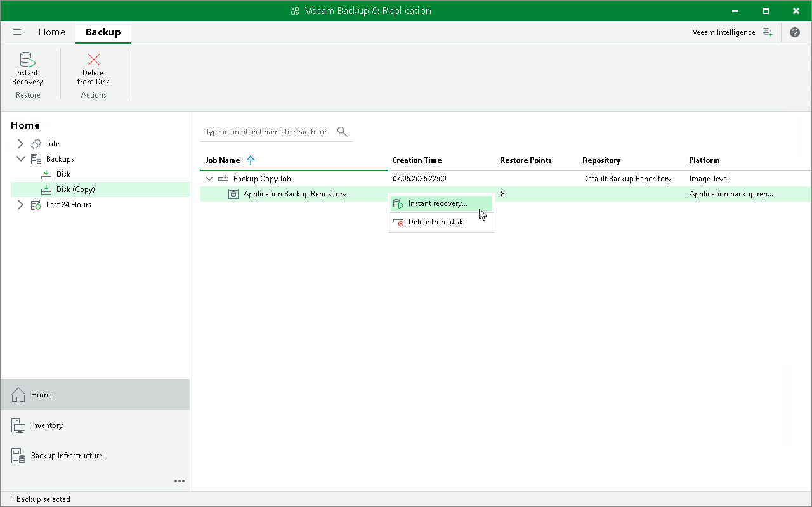

# Step 1. Launch Application Backup Repository Restore Wizard

To launch the Application Backup Repository Restore wizard, do the following:

1. Open the Home view.
2. In the inventory pane, select Backups > Disk (Copy).
3. In the working area, expand the backup copy job, right-click the repository and select Instant recovery. Alternatively, you can click Instant Recovery on the ribbon.

Page updated 2026-06-15

