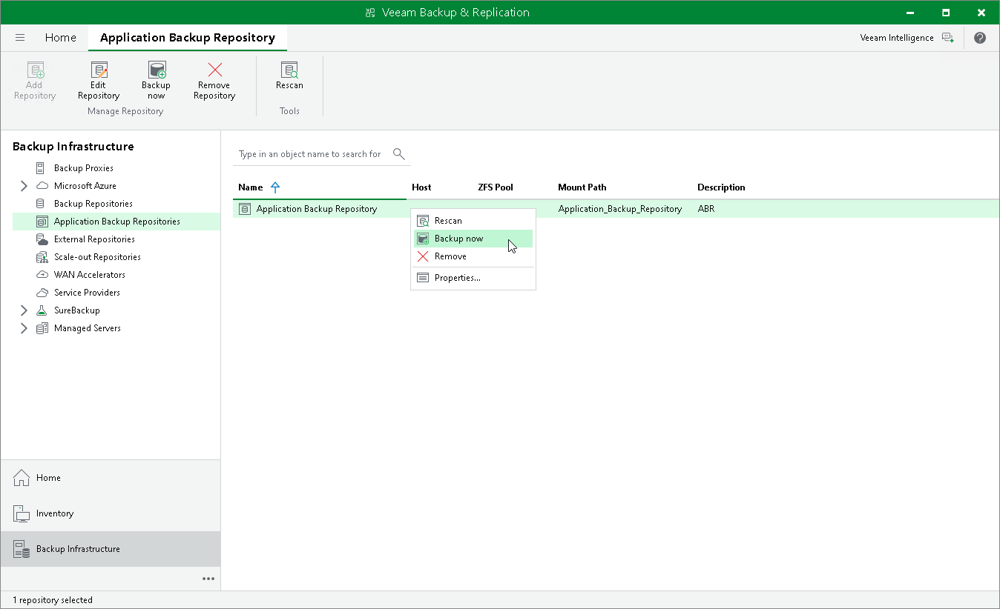

# Creating Snapshots Manually

You can create application backup repository snapshots manually in addition to the snapshot creation schedule you configured at the [Schedule](abr_repository_schedule.md) step of the New Application Backup Repository wizard. The snapshots created manually do not differ from the scheduled ones and can act as a restore point when performing instant application backup repository recovery. The retention policy for such snapshots follows the retention policy you configured in the New Application Backup Repository wizard.

|  |
| --- |
| Note |
| The manual creation of snapshots is disabled if the application backup repository license is revoked. |

To create an application backup repository snapshot:

1. Open the Backup Infrastructure view.
2. In the inventory pane, select Application Backup Repositories.
3. In the working area, select an application backup repository and click Backup now on the ribbon or right-click an application backup repository and select Backup now.

Page updated 2026-07-10

