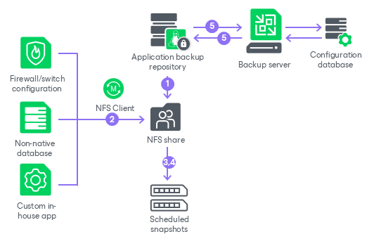

# How Application Backup Repository Works

An application backup repository is a smart NFS share hosted on a [Veeam Hardened Repository](hardened_repository_appliance_prepare.md) deployed from Veeam Infrastructure Appliance ISO. Applications write their native exports or dumps directly to the share, and Veeam Backup & Replication converts scheduled snapshots of that share into restore points.

An application backup repository works in the following way:

1. Once an application backup repository is added to the backup infrastructure and all the necessary components are installed, Veeam Backup & Replication creates a dedicated dataset on the pool you have specified in the New Application Backup Repository wizard and exports it as an NFS share. The required firewall ports are opened on the appliance side.
2. The application writes its native backups, exports, or dumps to the mounted NFS share by the path from the repository settings.
3. At the time configured in the repository snapshot schedule, Veeam Backup & Replication takes a snapshot of the repository dataset. The snapshot captures the full state of the NFS share at that moment and becomes one restore point.
4. To enforce immutability, Veeam Backup & Replication applies a hold to the snapshot. The hold duration equals the configured retention period and prevents the snapshot from being deleted before it expires.
5. The application backup repository sends a rescan notification to the backup server. Veeam Backup & Replication pulls the new restore point data, records it in the configuration database, and displays it in the console.

Page updated 2026-07-29

