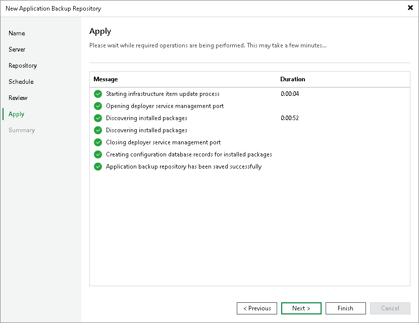

# Step 7. Apply Application Backup Repository Settings

At the Apply step of the wizard, wait for Veeam Backup & Replication to install and configure all required components. Then click Next to complete the procedure of adding the application backup repository to the backup infrastructure.

Page updated 2026-06-05

