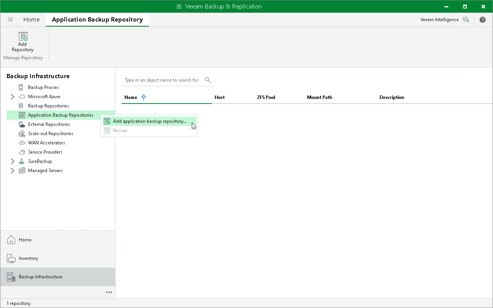

# Step 1. Launch New Application Backup Repository Wizard

To launch the New Application Backup Repository wizard, do the following:

1. Open the Backup Infrastructure view.
2. In the inventory pane, right-click the Application Backup Repositories node and select Add application backup repository. Alternatively, you can click Add Repository on the ribbon.

Page updated 2026-06-05

