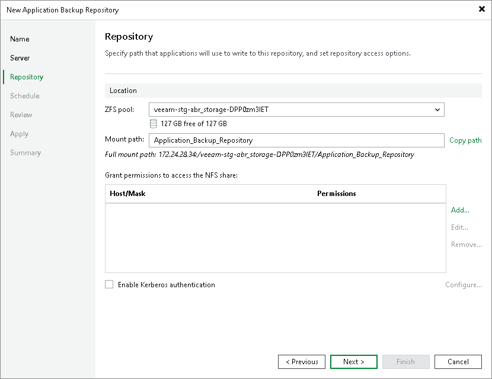
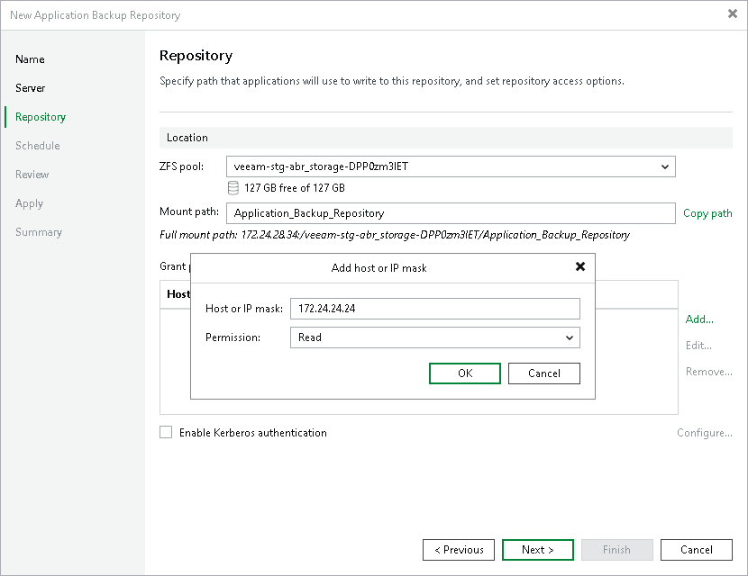
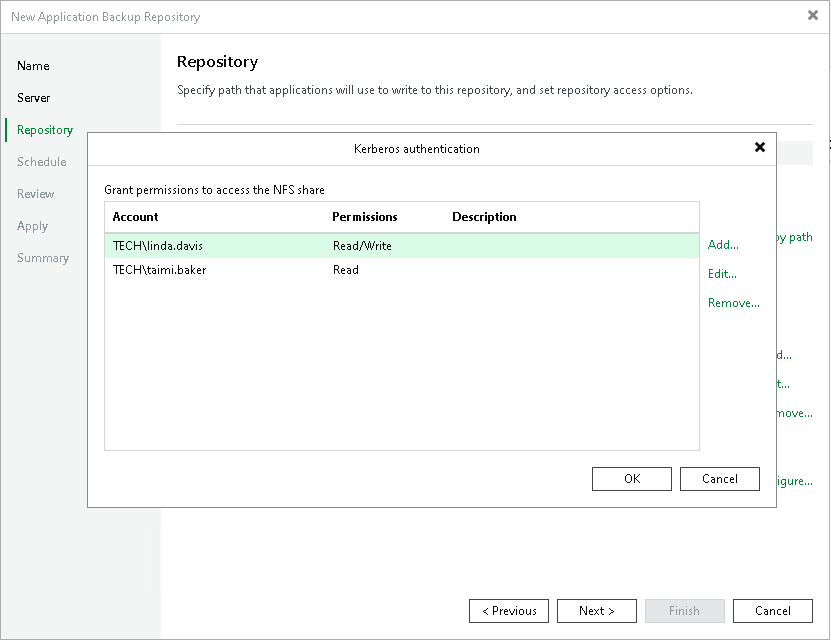

# Step 4. Configure Backup Repository Settings

At the Repository step of the wizard, configure application backup repository settings including the mount path for the NFS share, the NFS share access permissions and Kerberos authentication.

Configuring General Repository Settings

To configure general repository settings:

1. In the ZFS pool field, select a ZFS pool which will be used as storage. Below the ZFS pool field, you can check capacity and available free space in the selected location.
2. In the Mount path field, specify the mount path to the NFS share. Veeam Backup & Replication will mount the share on the application backup repository. Click Copy path to save the full mount path to your clipboard and use it with your NFS client to access the share and write data to it.

The full mount path is provided right under the Mount path field.

Configuring Access Permissions and Kerberos Authentication

To be able to read and write data to the mounted NFS share, you must set up access permissions for specific hosts, IP masks or users with Kerberos authentication. The default access permission settings are set to deny all and no NFS client can connect to the NFS share until explicitly permitted. For more information about requirements and limitations for access permissions and Kerberos authentication, see [Considerations and Limitations](abr_limitations.md#access).

To grant access permissions to a host or hosts under the IP mask:

1. Click Add next to the Grant permissions to access the NFS share table.
2. In the Add host or IP mask window, specify the hosts to whom you want to grant access permissions on the NFS share:

1. In the Host or IP mask field, enter the host DNS name or the subnet mask. You can enter the full DNS name or use a wildcard. For example, myhost.mydomain.com or \*.mydomain.com.
2. From the Permission list, select Read or Read/Write to define the scope of permissions given to the host.

To configure permissions based on the standard Windows Kerberos authentication protocol:

1. Check the Enable Kerberos authentication check box.
2. In the Kerberos authentication window, specify the user accounts or Active Directory groups to whom you want to grant access permissions on the NFS share:

1. Click Add next to the Grant permissions to access the NFS share table.
2. In the Username field, enter a user name for the account that you want to add. Specify the user name in the username@domain format. You can also click Browse to select an existing user account.
3. From the Permission list, select Read or Read/Write to define the scope of permissions given to the user account.

|  |
| --- |
| Note |
| The user account or group you use for Kerberos authentication must be resolvable from both the backup server host and the application backup repository host via the same Active Directory or Kerberos realm, or via a trusted realm or domain. |

Page updated 2026-07-22

