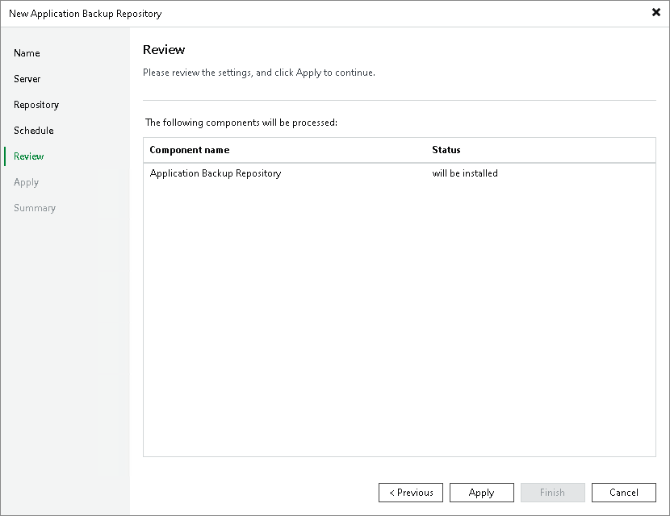

# Step 6. Review Settings and Components

At the Review step of the wizard, review the list of components that will be installed on the application backup repository server.

Page updated 2026-06-05

