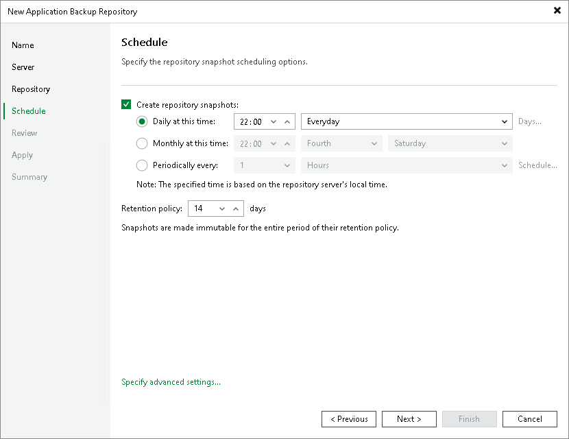
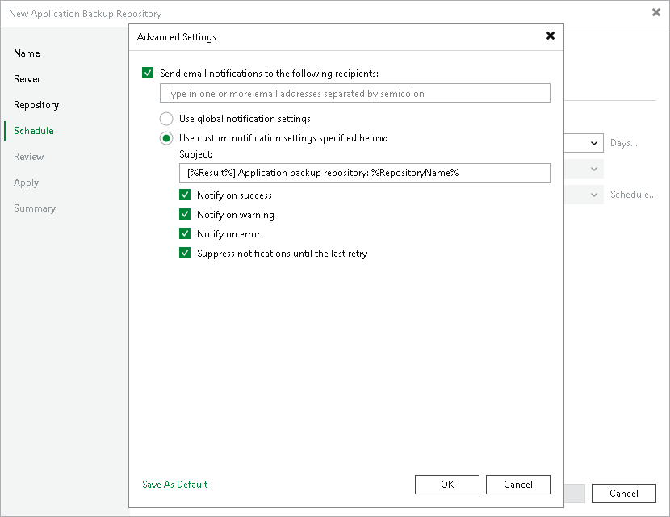

# Step 5. Specify Snapshot Scheduling Options

At the Schedule step of the wizard, you can define the schedule that Veeam Backup & Replication will use to create repository snapshots on a regular basis:

1. To specify the snapshot schedule, select the Create repository snapshots check box. If this check box is not selected, repository snapshots are not created.

|  |
| --- |
| Note |
| Consider the following:   * If the Create repository snapshots check box is disabled for a repository, Veeam Backup & Replication does not apply retention policy to the repository snapshots. * Once the application backup repository license is revoked, the snapshot schedule is automatically disabled. |

1. Select the required schedule option:

* Daily at this time. The snapshot will be created at a specific time daily, on weekdays or with specific periodicity. In the fields on the right of the radio button, specify the time and required days.
* Monthly at this time. The snapshot will be created once a month on specific days. In the fields on the right of the radio button, specify the necessary days.
* Periodically every. The snapshot will be created repeatedly throughout a day with a set time interval.

To configure the period and allowed hours, do the following:

1. In the field on the right of the radio button, select the necessary period and time unit.
2. If you want to specify the permitted time window for the job, click Schedule. In the Time Periods window, specify the schedule.

If you want to shift the schedule, specify the offset in the Start time within an hour field. For example, you schedule the prohibited hours from 08:00 AM to 10:00 AM, and set the offset value to 25. The schedule will be shifted forward, and the prohibited hours will be from 8:00 AM and to 10:25 AM.

A repeatedly run job is started by the following rules:

* Veeam Backup & Replication always starts counting defined intervals from 12:00 AM. For example, if you configure the schedule to create a snapshot with a 4-hour interval, the snapshot will be created at 12:00 AM, 4:00 AM, 8:00 AM, 12:00 PM, 4:00 PM and so on.
* If you define permitted hours for the snapshot creation, after the denied interval is over, Veeam Backup & Replication will immediately create the snapshot and continue to follow the defined schedule. For example, you have configured the schedule to create a snapshot every 2 hours and defined permitted hours from 9:00 AM to 5:00 PM. According to the rules above, the snapshot will be created at 9:00 AM, when the denied period is over. After that, the snapshot will be created at 10:00 AM, 12:00 PM, 2:00 PM and 4:00 PM.

|  |
| --- |
| Note |
| The schedule uses the repository host's local time. |

1. In the Retention policy field, specify the number of days the repository snapshots will be kept and made immutable for.

1. To configure email notification settings for the snapshot creation session, click Specify advanced settings.
2. In the Advanced Settings window, select the Send email notifications to the following recipients check box if you want to receive notifications about the snapshot creation status by email. In the field under the check box, specify the recipient’s email address. You can enter several addresses separated by a semicolon.

Email notifications will be sent if you configure global email notification settings in Veeam Backup & Replication. For more information, see [Configuring Global Email Notification Settings](general_email_notifications.md).

You can choose to use global notification settings or specify custom notification settings:

* To receive a typical notification for the job, select Use global notification settings. In this case, Veeam Backup & Replication will apply to the job global email notification settings specified for the backup server. For more information, see [Configuring Global Email Notification Settings](general_email_notifications.md).
* To configure a custom notification for the job, select Use custom notification settings specified below check box. You can specify the following notification settings:

1. In the Subject field, specify a notification subject. You can use the following variables in the subject: %Time% (completion time), %JobName%, %JobResult%, %ObjectCount% (number of objects in the session) and %Issues% (sessions that have finished with the Warning or Failed status).
2. Select the Notify on success, Notify on warning and Notify on error check boxes to receive email notification if the job completes successfully, fails or completes with a warning.
3. Select the Suppress notifications until the last retry check box to receive a notification about the final job status. If you do not enable this option, Veeam Backup & Replication will send one notification per every job retry.

Page updated 2026-06-15

