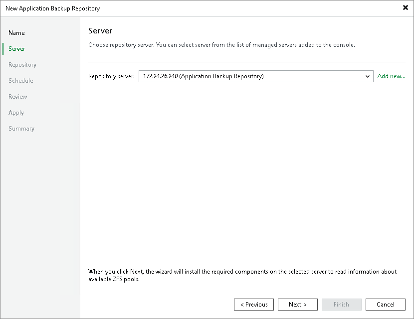

# Step 3. Specify Server Settings

From the Repository server list, select an appliance that you want to use as an application backup repository. The Repository server list contains only those servers that are added to the backup infrastructure. If the server is not added to the backup infrastructure yet, you can click Add New to open the New Linux Server wizard. For more information, see [Adding Veeam Infrastructure Appliances](adding_via.md).

When you click Next, Veeam Backup & Replication will install the necessary components on the repository server.

Page updated 2026-06-15

