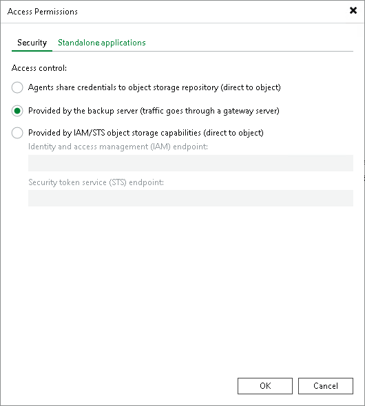

# Editing Access Permissions

In this article

If you want to store in the backup repository backups of virtual and physical machines created by Veeam Backup & Replication additional solutions, for example, [Veeam Agent for Microsoft Windows](agents_introduction.md), [Veeam Agent for Linux](agents_introduction.md), [Veeam Plug-Ins for Enterprise Applications](protect_applications.md) and so on, you must set up access permissions to backup repositories.

Access permissions are granted to security principals such as users and AD groups by the backup administrator who works with Veeam Backup & Replication. Users with granted access permissions can target backup jobs created by additional solutions at this backup repository and perform restore from backups located in this backup repository.

|  |
| --- |
| Note |
| Consider the following:   * If you plan to create backups in a Veeam backup repository with Veeam Agent backup jobs configured in Veeam Backup & Replication, you do not need to grant access permissions on the backup repository to users. In the Veeam Agent management scenario, to establish a connection between the backup server and protected computers, Veeam Backup & Replication uses a TLS certificate. To learn more, see the [Configuring Security Settings](agents_manage_tls_and_ssh.md) section in Veeam Agent Backup. * If you plan to create backups in a Veeam backup repository with Veeam Plug-In for Nutanix AHV, you do not need to grant access permissions when configuring repositories, you must do that when [configuring Nutanix AHV backup appliances](https://helpcenter.veeam.com/docs/vbahv/userguide/manage_proxy.html?ver=9). |

Right after installation, access permissions on the default backup repository are set to Allow to everyone for testing and evaluation purposes. If necessary, you can change these settings.

After you create a new backup repository, access permissions on this repository are set to Deny to everyone. To allow users to store backups in the backup repository, you must grant users with access permissions to this repository.

Managing Permissions of Backup Repositories

To grant access permissions to a security principal:

1. Open the Backup Infrastructure view.
2. In the inventory pane, click one of the following nodes:

* The Backup Repositories node — if you want to grant access permissions on a regular backup repository.
* The Scale-out Repositories node — if you want to grant access permissions on a scale-out backup repository.

1. In the working area, select the necessary backup repository and click Set Access Permissions on the ribbon or right-click the backup repository and select Access permissions. If you do not see the Set Access Permissions button on the ribbon or the Access permissions command is not available in the shortcut menu, press and hold the [Ctrl] key, right-click the backup repository and select Access permissions.

1. In the Standalone applications window, specify to whom you want to grant access permissions on this backup repository:

* Allow to everyone — select this option if you want all users to be able to store backups in this backup repository. Setting access permissions to Everyone is equal to granting access rights to the Everyone Microsoft Windows group (Anonymous users are excluded). Note, however, this scenario is recommended for demo environments only.
* Allow to the following accounts or groups only — select this option if you want only specific users to be able to store backups in this backup repository. Click Add to add the necessary users and groups to the list.

Managing Permissions for S3 Compatible Object Storage

If you plan to use S3 compatible object storage as an object storage repository, you must set up access permissions to the object storage. These permissions are used if you keep in object storage repositories backups created by Veeam Agent or by Veeam Cloud Connect tenant. For more information, see [Backup to Object Storage](agents_object_storage.md) in Veeam Agent Backup and [Backup to Object Storage](https://helpcenter.veeam.com/docs/vbr/cloud/cc_object_storage.html?ver=13) in the Veeam Cloud Connect Guide.

To manage permissions for S3 compatible object storage, perform the following:

1. In Veeam Backup & Replication, open the Backup Infrastructure view.

1. In the [inventory pane](vbr_ui.md), click the Backup Repositories node.

1. In the working area, select the necessary S3 compatible object storage and click Set Access Permissions on the ribbon or right-click the backup repository and select Access permissions. If you do not see the Set Access Permissions button on the ribbon or the Access permissions command is not available in the shortcut menu, press and hold the [Ctrl] key, right-click the backup repository and select Access permissions.
2. On the Security tab, specify how Veeam Agent or a tenat will access an S3 compatible object storage repository:

* Agents share credentials to object storage repository — select this option if you use the direct connection mode to access the S3 compatible object storage repository. In this case, Veeam Agent will use credentials that you specified when added the S3 compatible object storage repository to the backup infrastructure.

|  |
| --- |
| Important |
| This option is not secure since Veeam Backup & Replication will have access permissions on the bucket where you keep your folders with backups. |

* Provided by the backup server — select this option if you want to access the S3 compatible object storage repository through a gateway server. By default, Veeam Backup & Replication uses this option.

|  |
| --- |
| Note |
| If you use the direct mode to connect to the S3 compatible object storage repository, the access permissions will override the repository settings and the object storage will be accessed indirectly. In this case, Veeam Backup & Replication will use a mount server to access the S3 compatible object storage repository. |

* Provided by IAM/STS object storage capabilities — select this option if you use the direct connection mode to access the S3 compatible object storage repository. In this case, Veeam Backup & Replication will create service tokens that Veeam Agent or a tenant will use to access the S3 compatible object storage repository.

To specify credentials, do the following:

1. In the Identity and access management (IAM) endpoint field, specify the endpoint of your S3 compatible object storage repository.

1. In the Security token service (STS) endpoint field, specify the security token.

Page updated 11/13/2025

Page content applies to build 13.0.1.1071
