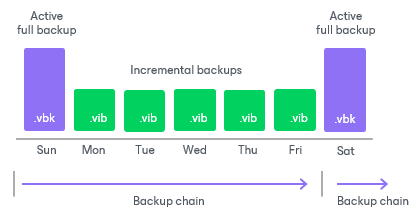
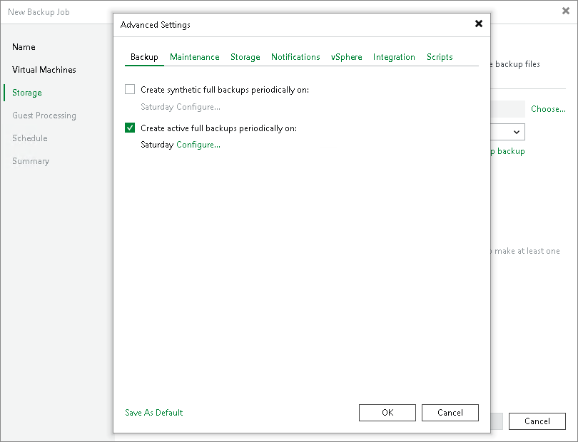

# Active Full Backup

In some cases, you need to create a full backup regularly. For example, your corporate backup policy may require you to create a full backup on weekends and run incremental backup on work days. To let you conform to these requirements, Veeam Backup & Replication lets you create active full backups.

The active full backup produces a full backup of a VM, just as if you run the backup job for the first time. Veeam Backup & Replication retrieves data for the whole VM from the source, compresses and deduplicates it and stores it in the full backup file — VBK.

The active full backup resets a backup chain. All incremental backup files use the latest active full backup file as a new starting point. A previously used full backup file remains on disk until it is automatically deleted according to the retention policy.

You can create active full backups manually or schedule a backup job to create active full backups periodically.

* To create an active full backup manually, follow the steps described in section [Performing Active Full Backup](performing_active_full_backup_hv.md).
* To schedule active full backups, specify scheduling settings in the Advanced Settings section of a backup job. You can schedule active full backups to run weekly, for example, every Saturday. You can also schedule them monthly, for example, every fourth Sunday of a month.

Active Full Backup Schedule

Veeam Backup & Replication automatically triggers a backup job to create an active full backup, even if a regular backup job session is not scheduled on this day. The job session is started at the same time the parent backup job is scheduled. For example, if you schedule the parent backup job at 12:00 AM Sunday through Friday, and schedule active full backup on Saturday, Veeam Backup & Replication will start a backup job session that will produce an active full backup at 12:00 AM on Saturday.

If the parent backup job is not scheduled to run automatically or is disabled, Veeam Backup & Replication will not perform active full backup.

If a regular backup job is scheduled together with an active full backup, Veeam Backup & Replication will produce only an active full backup that will contain the latest state of the source VM. An incremental backup file that should have been created by the backup job schedule will not be added to the backup chain.

Veeam Backup & Replication creates an active full backup only once a day on which active full backup is scheduled (unless you create a full backup manually). If you run the backup job again on the same day, Veeam Backup & Replication will perform incremental backup in a regular manner.

|  |
| --- |
| Important |
| If you schedule a job to start after another job (initial job), but the initial job does not run on days when the active full backup is scheduled for the chained job, Veeam Backup & Replication will not create active full backups. |

