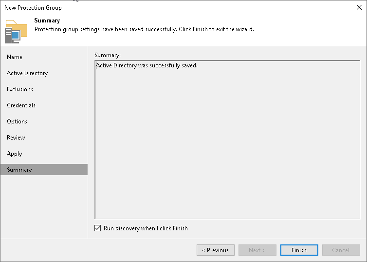

# Step 10. Finish Working with Wizard

At the Summary step of the wizard, complete the protection group configuration process.

1. Review information about the created protection group.
2. To start the rescan job after you close the wizard, make sure that the Run discovery when I click Finish option is selected.

If you want to perform computer discovery later, you can clear the Run discovery when I click Finish check box. In this case, the rescan job will start automatically upon the defined schedule. You can also start the rescan job manually at any time you need. To learn more, see [Starting Protection Group Discovery](protection_group_rescan.md).

1. Click Finish to close the wizard.

