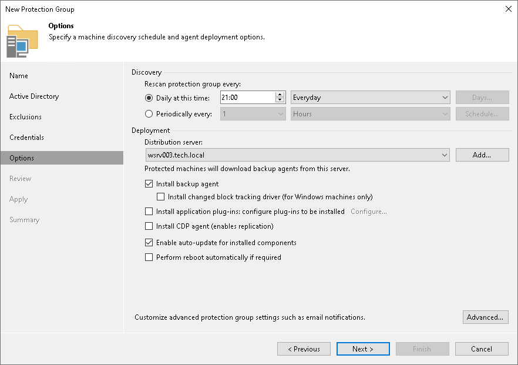

# Step 6. Specify Discovery and Deployment Options

At the Options step of the wizard, specify settings for protected computers discovery and Veeam Agent deployment.

Veeam Backup & Replication regularly connects to protected computers according to the schedule defined in the protection group settings. At this step of the wizard, you can define the discovery schedule and specify operations that Veeam Backup & Replication must perform on discovered computers. You can also select which server in your backup infrastructure should act as a distribution server for Veeam Agents.

|  |
| --- |
| TIP |
| To learn how to use protection groups to automatically deploy Veeam plug-ins for enterprise applications, see [Database-Level Backup with Veeam Plug-Ins or MongoDB Backup](https://helpcenter.veeam.com/docs/vbr/userguide/protect_applications.html?ver=13#database-level-backup-with-veeam-plug-ins-or-mongodb-backup).  To learn how to use protection groups to automatically deploy Veeam CDP Agent Service and Veeam CDP Volume Filter Driver for universal continuous data protection (CDP), see [Universal CDP to VMware vSphere](universal_cdp.md). |

To specify discovery and deployment options:

1. In the Discovery section, define schedule for automatic computer discovery within the scope of the protection group:

* To run the rescan job at specific time daily, on defined week days or with specific periodicity, select Daily at this time. Use the fields on the right to configure the necessary schedule.
* To run the rescan job repeatedly throughout a day with a specific time interval, select Periodically every. In the field on the right, select the necessary time unit: Hours or Minutes. Click Schedule and use the time table to define the permitted time window for the rescan job. In the Start time within an hour field, specify the exact time when the job must start.

* To run the rescan job continuously, select the Periodically every option and choose Continuously from the list on the right. A new rescan job session will start as soon as the previous rescan job session finishes.

|  |
| --- |
| NOTE |
| You cannot create a protection group without defining schedule for automatic discovery. However, you can disable automatic discovery for a specific protection group, if needed. To learn more, see [Disabling Protection Group](agents_protection_group_disable.md). |

1. In the Deployment section, from the Distribution server list, select a server that you plan to use as a distribution server. Veeam Backup & Replication will use the distribution server to upload Veeam Agent setup files to computers added to the protection group. By default, Veeam Backup & Replication assigns the distribution server role to the backup server. To learn more, see [Distribution Server](agents_infrastructure.md#distribution).
2. If you want to instruct Veeam Backup & Replication to automatically deploy Veeam Agents on all discovered computers in the protection group, in the Deployment section, make sure that the Install backup agent check box is selected.

You can also choose to disable automated Veeam Agent installation. In this case, you will need to install Veeam Agent on every computer included in the protection group and discovered by Veeam Backup & Replication. To learn more, see [Installing Veeam Agent](agents_protected_computers_install.md).

Keep in mind that Veeam Backup & Replication installs the Veeam Installer Service or Veeam Deployer Service, Veeam OpenSSL3 FIPS Provider and Veeam Transport Service on every computer added to the protection group even if the Install backup agent check box is not selected in the protection group settings. If Veeam Transport Service is already installed on a computer, Veeam Backup & Replication checks its version and upgrade Veeam Transport Service if a later version is available.

1. If you want to instruct Veeam Backup & Replication to automatically upgrade Veeam Agent on discovered computers when a new version of Veeam Agent appears on the Veeam Backup & Replication server, in the Deployment section, make sure that the Enable auto-update for installed components check box is selected.

1. Select the Install changed block tracking driver check box if you want to install the advanced changed block tracking (CBT) driver on computers protected with Veeam Agent for Microsoft Windows.

Keep in mind that Veeam Backup & Replication will install the CBT driver only on those computers that run supported Microsoft Windows OS versions. To learn more, see [Installing Veeam CBT Driver](agents_protected_computers_driver.md).

|  |
| --- |
|  TIP |
| Veeam Backup & Replication can install the CBT driver on a wider range of Microsoft Windows OS versions, but Veeam Backup & Replication will not install drivers automatically after upgrade. To install drivers in the existing protection group on the computers running OS versions that got support only in Veeam Backup & Replication 13.0.1, open the Edit Protection Group wizard, make sure that the Install changed block tracking driver check box is selected and re-save the protection group. |

1. Select the Perform reboot automatically if required check box to allow Veeam Backup & Replication to reboot a protected computer. In particular, the reboot operation is required as part of the Veeam CBT driver installation process.
2. Click Advanced to specify advanced settings for the protection group. To learn more, see [Specify Advanced Protection Group Settings](ad_objects_advanced.md).

