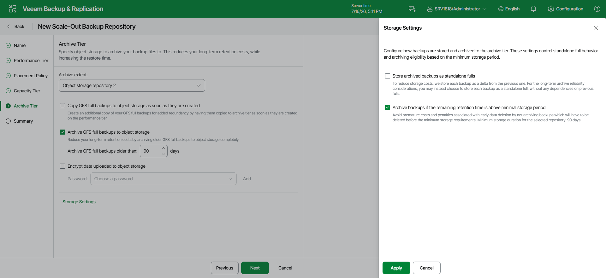

# Step 6. Add Archive Tier

Before you add an archive tier, [check the prerequisites](limitations_archive_tier.md).

At the Archive Tier step of the wizard, select an object storage repository and configure the archive policy for GFS full backups.

|  |
| --- |
| Tip |
| If you have a compatible type of repository configured as a capacity extent, you can add an archive extent to an existing scale-out backup repository. To do so, select the scale-out backup repository, click Edit Scale-out Repository on the ribbon or right-click the scale-out backup repository and select Properties. In the Edit Scale-out Backup Repository wizard, go to the Archive Tier step and proceed with the following steps. |

Consider the following:

* The Archive Tier step of the wizard appears only if you have a compatible type of repository configured as a capacity extent or a performance tier. For more information, see [Limitations for Archive Tier](limitations_archive_tier.md).
* You can add only one archive extent per scale-out backup repository.

To configure the archive extent, do the following:

1. Select the Archive GFS full backups to object storage check box. In the drop-down list, select an object storage repository or click Add to add a new one.
2. To use the copy policy, select the Copy GFS full backups to object storage as soon as they are created check box. Veeam Backup & Replication will copy GFS full backups from the performance tier to the archive tier at the next archiving job run. For more information, see [Copy Policy](archive_tier_policies.md#copy_policy).

|  |
| --- |
| Important |
| The Copy policy is available only for direct archiving from the performance tier. If the scale-out backup repository includes a capacity tier, only the Move policy is available for the archive tier. |

1. To use the move policy, select the Archive GFS full backups to object storage after specified number of days check box. In the Move GFS full backups older than N days field, specify the archive window settings. Note that 0 is an acceptable value: if you specify 0, Veeam Backup & Replication will archive inactive restore points on the same day they become inactive. For more information, see [Move policy.](archive_tier_policies.md#move_policy)

You can select both check boxes to use the Copy and Move policies simultaneously. For more information, see [Combining move and copy policies.](archive_tier_policies.md#modeandcopy)

1. To encrypt data in the archive extent, select Encrypt data uploaded to object storage and provide a strong password. Veeam Backup & Replication will encrypt the entire collection of blocks along with the metadata during the archive job. If you have not created the password beforehand, click Add or use the Manage passwords link to specify a new password. For more information, see [Encryption for Archive Tier](encryption_for_archive_tier.md).

|  |
| --- |
| Note |
| If you have encryption on the capacity tier level but do not enable encryption on the archive tier level, the backups will not be encrypted in the archive tier. |

Specifying Storage Settings

You can use the default storage settings or specify them manually. For that, click Storage settings.

* Select the Store archived backups as standalone fulls check box to forbid reuse of data blocks.
* Select the Archive backups only if the remaining retention time is above minimal storage period check box to specify which data blocks can be transported to the archive tier.

When you add as an archive extent an object storage repository that contains archived backup data, you will be prompted to synchronize existing backup chains with data in this scale-out backup repository. After the synchronization is complete, the existing backups will become available as Imported and will be displayed in the Home view, under the Archive Tier (Imported) node in the [inventory pane](vbr_ui.md).

Page updated 2026-07-30

