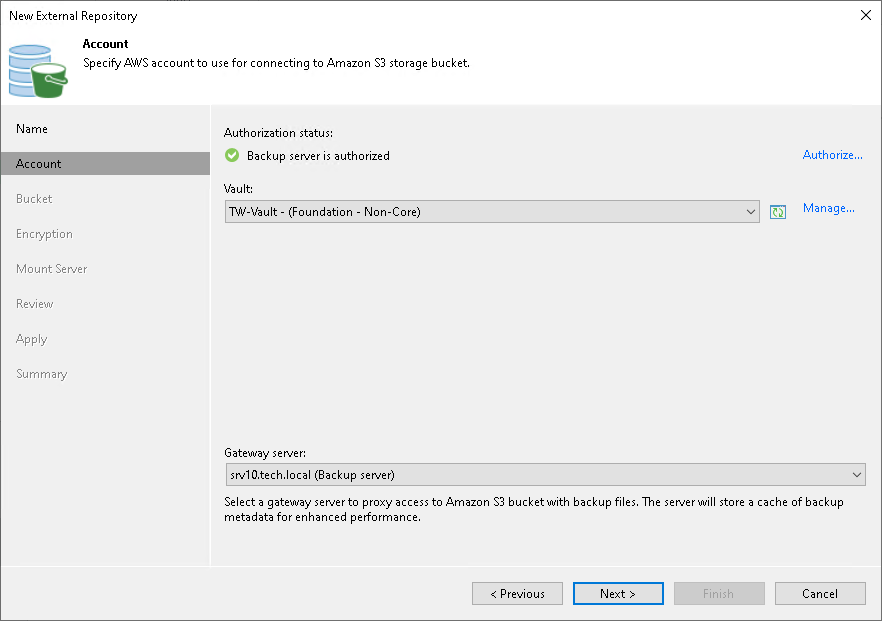

# Step 3. Choose Storage Vault

At the Account step of the wizard, choose a storage vault that will be used as a target location for image-level backups.

For a storage vault to be displayed in the list of available vaults, it must be created in Veeam Data Cloud Vault as described in the Veeam Data Cloud User Guide, section [Adding Storage Vaults for AWS Edition](https://helpcenter.veeam.com/docs/vdc/userguide/vault_storage_vaults_add_aws.html). If you have not created the storage vault beforehand, you can do it without closing the New External Repository wizard. To do that, click Manage, specify credentials of a Veeam account that will be used to create the storage vault, and complete the Add Vault wizard.

|  |
| --- |
| Tip |
| If you create a storage vault in Veeam Data Cloud Vault but it is still not displayed in the list of available vaults, click the Refresh icon to launch the data collection process. |

To allow both the backup appliance and the backup server to use the storage vault as a backup target, do the following:

1. Register the backup server in Veeam Data Cloud Vault — to do that, click Authorize. Then, specify credentials of a Veeam account that will be used to access the storage vault and click Log in in the opened authentication window.
2. Assign the storage vault to the backup server as described in the Veeam Data Cloud User Guide, section [Managing Storage Vaults](https://helpcenter.veeam.com/docs/vdc/userguide/vault_storage_vaults_edit.html#assigning-storage-vaults-to-workloads).
3. From the Gateway server drop-down list, select a gateway server that will be used to access the storage vault.

For a server to be displayed in the Gateway server list, it must be added to the backup infrastructure. For more information on gateway servers, see [Solution Architecture](aws_overview.md).

Page updated 2026-07-20

