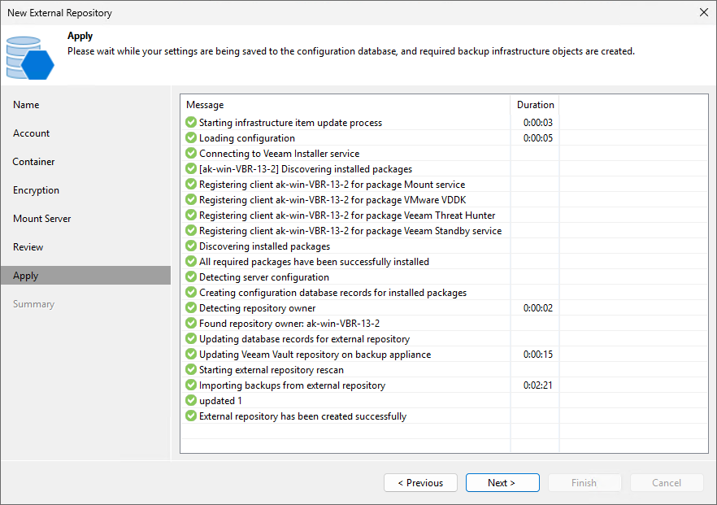

# Step 8. Apply Settings

At the Apply step of the wizard, wait until Veeam Backup & Replication applies settings and completes adding the external repository. Then click Next.

Page updated 2026-07-28

