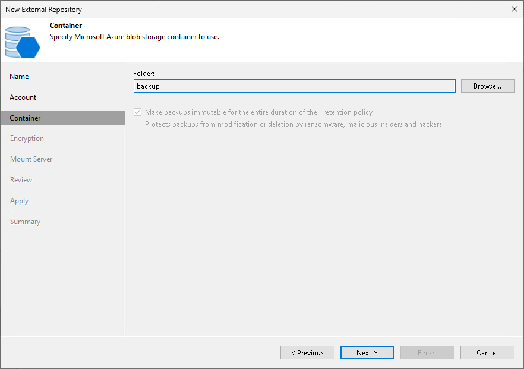

# Step 4. Choose Target Folder

After you choose a storage vault at step 3 of the wizard, Veeam Backup & Replication automatically detects both the Azure region where the vault is located and the storage account that is associated with it. The product also creates a new folder inside the container that will be used to group your backup files; you can use either this new folder or any other folder that already exists in the container — to do that, click Browse at the Container step.

|  |
| --- |
| Note |
| Veeam Backup & Replication does not support adding storage vaults with immutability disabled. That is why you will not be able to clear the Make backups immutable for the entire duration of their retention policy check box. For more information on the immutability feature, see [Immutability](azure_immutability.md). |

Page updated 2026-07-28

