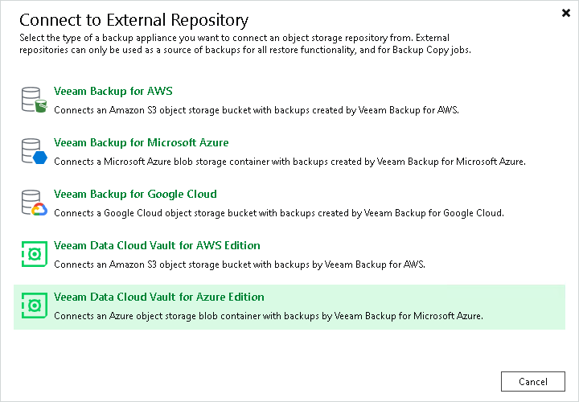

# Step 1. Launch New External Repository Wizard

To launch the New External Repository wizard, do one of the following:

* Open the Backup Infrastructure view. In the [inventory pane](vbr_ui.md) select the External Repositories node and click Connect to Repository on the ribbon. At the Connect to External Repository window, select Veeam Data Cloud Vault for Azure Edition.
* Open the Backup Infrastructure view. In the [inventory pane](vbr_ui.md) right-click the External Repositories node and select Connect to... At the Connect to External Repository window, select Veeam Data Cloud Vault for Azure Edition.

Page updated 2026-07-14

