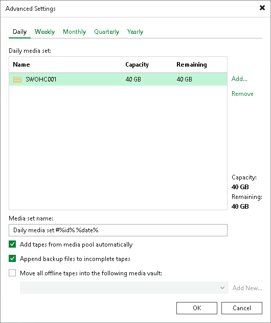

# Step 5. Specify Advanced Media Set Options

You can granularly configure rules for each media set.

At the GFS Media Set step of the wizard, click Advanced. Select the Daily tab to configure the daily media set.

1. If you want the Daily media set to span several selected tapes, click Add and select tapes that should be added to the media set. You can select from tapes added to the media pool at the Tapes step of the wizard. The selected tapes will be displayed in the Daily media set field.

This option is useful if you want the media set to use some particular user-defined tapes. Otherwise, you can use the Add tapes from media pool automatically option.

1. In the Media set name field, define the pattern according to which the created media set will be named. For more information, see [Media Set Names](media_set_names.md).
2. Select the Add tapes from media pool automatically check box to allow the media set to take a tape from the media pool when required.
3. Select Append backup files to incomplete tapes check box if you want to write the next backup set to the tape where the previous backup set was written. Otherwise, the GFS tape job will use a new tape for each backup set.
4. You can set automatic moving tapes to a media vault when they are brought offline. To enable this option:

1. Select Move all offline tapes into the following media vault check box.
2. From the list of vaults, select the media vault where you want to automatically move the tapes.
3. If the vault is not added yet, click Add New to open the New Media Vault wizard. For more information, see [Creating Vaults](creating_media_vaults.md).

|  |
| --- |
| Note |
| Tapes written in this media set will always be used by this media set. Other media sets will not be able to use these tapes even after the data expires. |

Select the Weekly, Monthly, Quarterly or Yearly tabs to set the advanced media set options for weekly, monthly, quarterly and yearly media sets.

