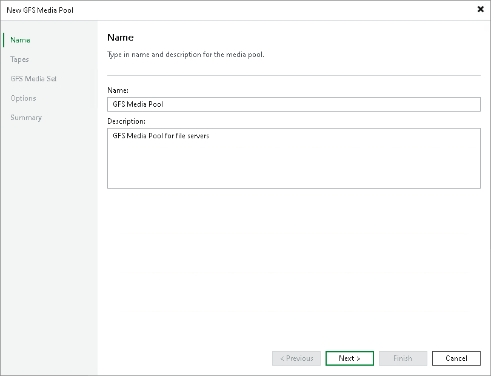

# Step 2. Specify Media Pool Name

In this article

At the Name step of the wizard, define basic description for the new GFS media pool.

1. In the Name field, enter a name for the created media pool.
2. In the Description field, enter a description of the new media pool. The default description contains information about the user who created the media pool, date and time when the media pool was created.

Page updated 5/20/2025

Page content applies to build 13.0.1.1071
