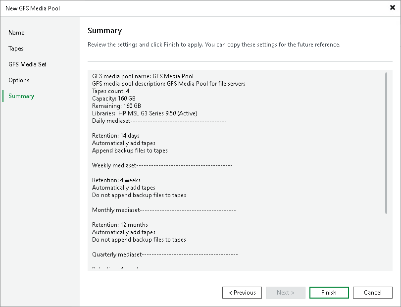

# Step 7. Finish Working with Wizard

Review the media pool settings and click Finish to complete the wizard.

A new media pool will be available under the Tape Infrastructure > Media Pools node in the Tape Infrastructure view.

