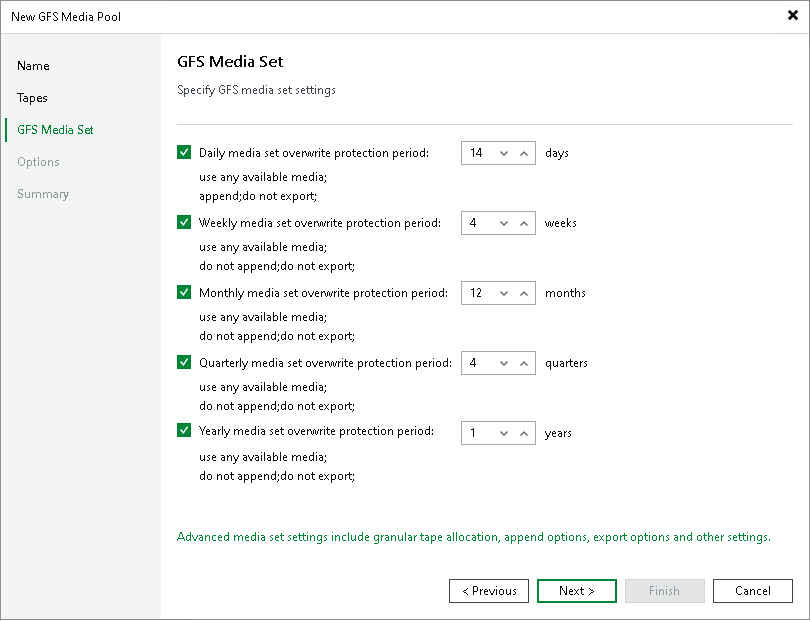

# Step 4. Specify Media Set Options

In this article

In the GFS media pool, a separate media set is created for each backup cycle: daily, weekly, monthly, quarterly and yearly.

For each media set, you can set the data retention period. The retention period indicates for how long the data is protected from overwriting.

Usually, daily media sets do not contain full backups as daily backups are mostly used to keep day-to-day incremental changes. To complete the backup chain they use the periodic full backup stored in the weekly or monthly media set. We recommend to enable the usage of weekly media sets or carefully consider the retention plan.

Click Advanced to configure the advanced media set options.

Page updated 5/20/2025

Page content applies to build 13.0.1.1071
