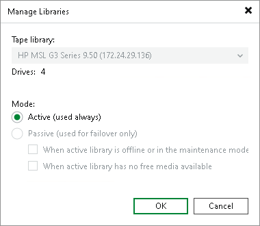
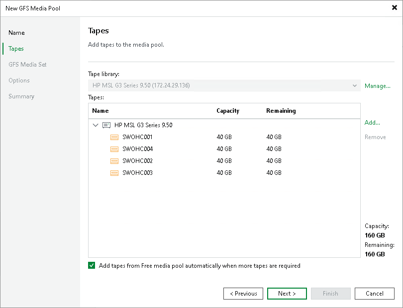

# Step 3. Add Tapes to Media Pool

At the Tapes step of the wizard, you can select tape libraries and allocate tapes for the pool.

1. From the list in the Tape library field, select the tape device that you want to use in this media pool. The list contains all tape libraries managed by this Veeam backup server.
2. To add more libraries, click Manage. For one media pool, you can select any tape devices that are managed by this Veeam backup server even if they are connected to different tape servers.

Click Add to add other tape libraries.

Configure the multiple libraries mode:

* Active: in this mode, tape jobs use drives in all libraries parallelly. For more information, see [Tape Parallel Processing](parallel_processing.md).

To enable the parallel processing mode, set all libraries role to Active. To do this, select a library and click Edit. Use Up and Down buttons to position the libraries in order they must be used.

* Passive: in this mode, the first library in the list is active and is primarily used for writing data. Other libraries added to this media pool are passive and are used for failover in the following events:

* The primary library is unavailable.
* The primary library has no media available.

To enable the failover mode, set the first library role to Active and all other libraries roles to Passive. To do this, select a library from the list and click Edit. Use Up and Down buttons to position the libraries in order they must fail over. Also ensure that you select at least one failover event.

On the next backup session, Veeam Backup & Replication will try to switch back to the primary library. If it is still not available, the media pool fails over to the next library as defined.

|  |
| --- |
| Note |
| If you enable the failover mode, email notifications can be sent when Veeam Backup & Replication switches to a passive tape library during failover. Notifications are sent under either of the following conditions:   * The Notify on failure check box is selected in the Veeam Backup & Replication global notification settings. For more information, see [Configuring Global Email Notification Settings](general_email_notifications.md). * The Notify on error check box is selected in the tape job notification settings. For more information, see [Notifications Settings](backup_to_tape_notifications.md).   If you enable the parallel processing mode, no email notifications are sent when Veeam Backup & Replication switches from one library to another. |

1. To allocate specific tapes from the library, click the Add in the Tapes field and select tapes that should be added to the media pool. Allocated tapes will be reserved for the created media pool; other media pools will not be able to use these tapes. The capacity and free space on the allocated tapes will be displayed in the bottom right corner.

Allocate standard tapes to the standard media pool and WORM tapes to the WORM media pool. Do not mix standard and WORM tapes in one media pool.

1. To make the media pool replenishable, select the Add tapes from Free media pool automatically when more tapes are required check box.

With this option enabled, additional tapes will be allocated from the Free media pool when needed. That is, when a backup to tape or file to tape job uses all available tapes from this media pool, Veeam Backup & Replication will automatically add the required number of tapes from the Free media pool to let the job complete. If the option is disabled, the job will pause and prompt the backup administrator to add new tapes to the media pool.

To a standard media pool, Veeam Backup & Replication will add only standard tapes; to a WORM media pool Veeam Backup & Replication will add only WORM tapes.

