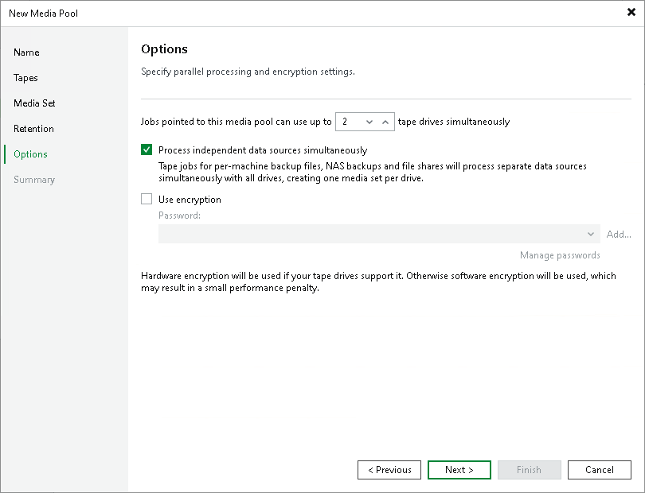

# Step 6. Add Optional Media Pool Settings

At the Options step of the wizard, you can enable encryption and configure parallel processing settings.

1. Set the maximum number of drives that the media pool can use in parallel for processing tape jobs in the Jobs pointed to this media pool can use up to N tape drives simultaneously field.

If you want to use multiple drives simultaneously to process multiple source backup chains within the tape jobs, select the Process independent data sources simultaneously check box. For more information, see [Tape Parallel Processing](parallel_processing.md).

1. To encrypt the content of files or backups archived to tapes in the media pool, select the Use encryption check box. In the Password field, select the encryption method you want to use — a password that will generate secret keys or an external KMS server that will generate KMS keys. For more information, see [Tape Encryption](encryption_tape.md).

If you have not created the password beforehand, click Add or use the Manage passwords link to specify a new password. For more information, see [Password Manager](password_manager.md).

If you do not use password loss protection, Veeam Backup & Replication will display a warning about it. For more information, see [Password Loss Protection](encryption_password_loss_protection.md).

