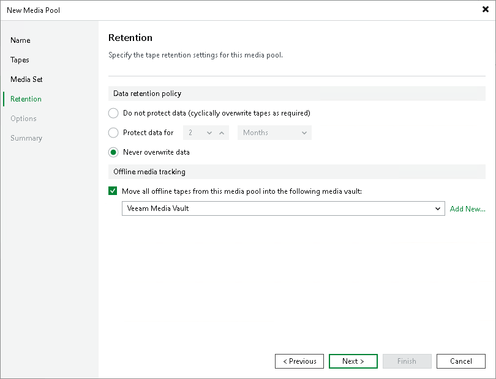

# Step 5. Specify Retention Settings

At the Retention step of the wizard, specify the retention settings and offline media tracking options for the tapes in this media pool. For more information, see [Tape Data Retention](tape_data_retention.md).

For WORM media pools, retention option is inapplicable; retention settings are inactive.

For standard media pools, you can select one of the following options:

* Do not protect data (cyclically overwrite tapes as required). If this option is selected, tapes allocated to the pool will be overwritten, starting with the tape that stores the oldest archive.
* Protect data for (time interval). If this option is selected, data on tapes will be preserved for the specified period. When this period is over, tapes will be overwritten, starting with the tape that stores the oldest archive. It is recommended to align this setting with the retention policy specified for the source backup chain:

* For [forward incremental](forward_incremental_backup.md) and [reverse incremental](reversed_incremental_backup.md) backup chains, you need to set the retention period for the tape archive at least twice longer than the retention period for source backups on disk.
* For [forever forward incremental](incremental_forever_backup.md) backup chain, you can set any retention period for the tape archive.

For more information on tape data retention, see [Tape Data Retention](tape_data_retention.md).

* Never overwrite data. If this option is selected, data on tapes will not be overwritten. If there is not enough tape capacity for the archiving job to complete, Veeam Backup & Replication will pause the job and prompt the backup administrator to add new tapes to the media pool.

|  |
| --- |
| Note |
| If at the previous step you selected the Do not create, always continue using current media set option, note that the retention period for such media sets starts after the first tape in the media set becomes full. |

In the Offline media tracking section, you can set automatic moving tapes to a media vault when they are brought offline. For more information on vaults, see [Vaults](tape_media_vaults.md).

To enable this option:

1. Select the Move all offline tapes from this media pool into the following media vault check box.
2. From the Vault list, select the media vault where you want to automatically move the tapes.

If the vault is not added yet, click Add New to open the New Media Vault wizard.

