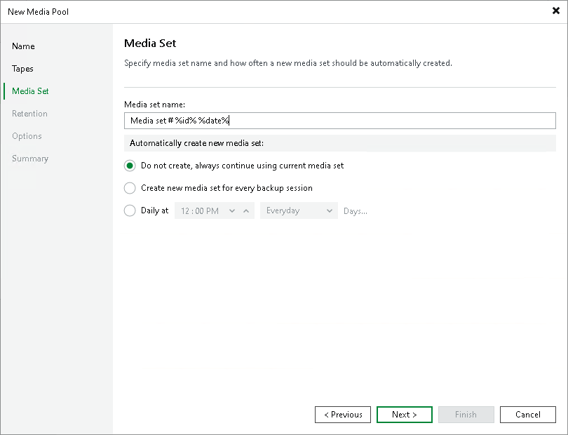

# Step 4. Specify Media Set Options

In this article

At the Media Set step of the wizard, specify rules for creating media sets. For more information, see [Media Sets](tape_media_sets.md).

In the Media set name field, define the pattern according to which created media sets will be named. For more information, see [Media Set Names](media_set_names.md).

In the Automatically create new media set section, specify conditions for creating new media sets on tapes allocated to the media pool. The following options are available:

* Do not create, always continue using current media set. If this option is selected, each subsequent backup session will write its backup set to the existing media set: it will append backup content to the content that was written to tape with a previous backup session. If, however, a backup set is started with a new tape, Veeam Backup & Replication will create a new media set for it.
* Create new media set for every backup session. If this option is selected, a new media set will be created for each new backup session. Each backup session will write its backup set starting with a new tape.
* Daily at. If this option is selected, you can specify day and time when new media sets should be created. For example, if at the end of the week you send weekly media sets to offsite storage, you can schedule creation of new media sets at the beginning of each week.

Page updated 5/20/2025

Page content applies to build 13.0.1.1071
