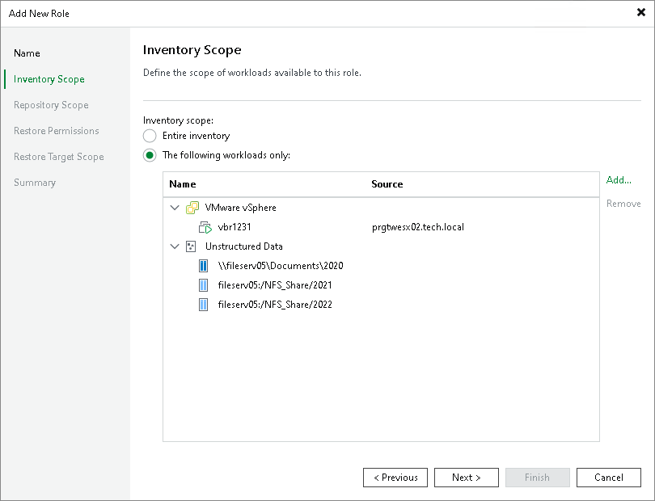

# Step 3. Define Inventory Scope

At the Inventory Scope step of the wizard, specify which workloads are available to this role:

* Entire inventory — grants access to all workloads managed by Veeam Backup & Replication.
* The following workloads only — restricts access to selected workloads. Click Add to choose specific VMs, file shares, or other objects from the inventory.

You can grant access to the following workloads:

* VMware vSphere
* Microsoft Hyper-V
* Physical machines
* File shares (NFS and SMB)
* Object storage repositories
* Specific backup copy jobs

