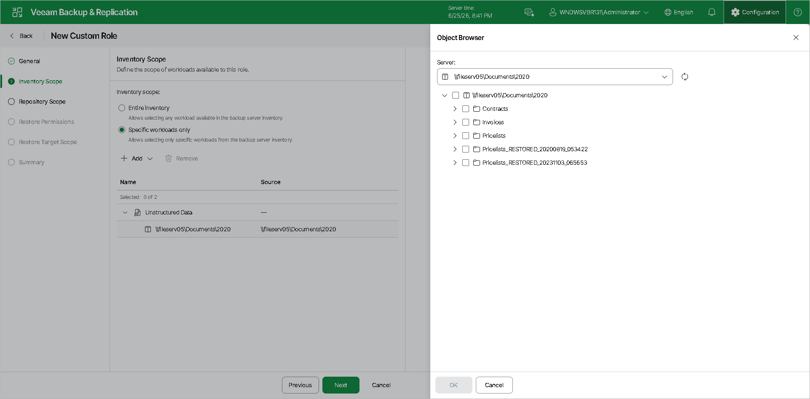

# Step 3. Define Inventory Scope

At the Inventory Scope step of the wizard, specify which workloads are available to this role:

* Entire inventory — grants access to all workloads managed by Veeam Backup & Replication.
* Specific workloads only — restricts access to selected workloads. Click Add to choose specific VMs, file shares, or other objects from the inventory. Select the necessary objects in the Object Browser that opens on the right.

Click Add to choose workloads from the following categories:

* Virtualization — VMware vSphere, Microsoft Hyper-V, Nutanix AHV, or Proxmox VE virtual machines.
* Physical infrastructure — physical servers and workstations.
* File shares — NFS and SMB file shares.
* Object storage — object storage repositories.
* Specific jobs — individual backup or backup copy jobs.

Page updated 2026-06-25

