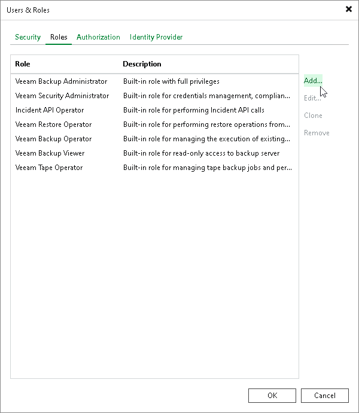

# Step 1. Launch Add New Role Wizard

In this article

To launch the Add New Role wizard:

1. From the main menu, select Users and Roles > Roles.
2. Click Add.

Page updated 8/6/2025

Page content applies to build 13.0.1.1071
