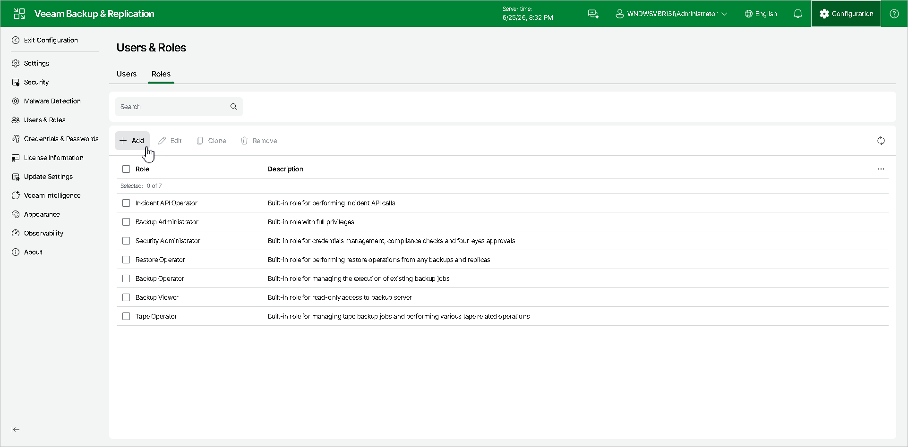

# Step 1. Launch Add New Role Wizard

To launch the New Custom Role wizard:

1. Click Configuration in the top bar.
2. In the management pane, click Users & Roles.
3. On the Roles tab, click Add.

Page updated 2026-06-25

