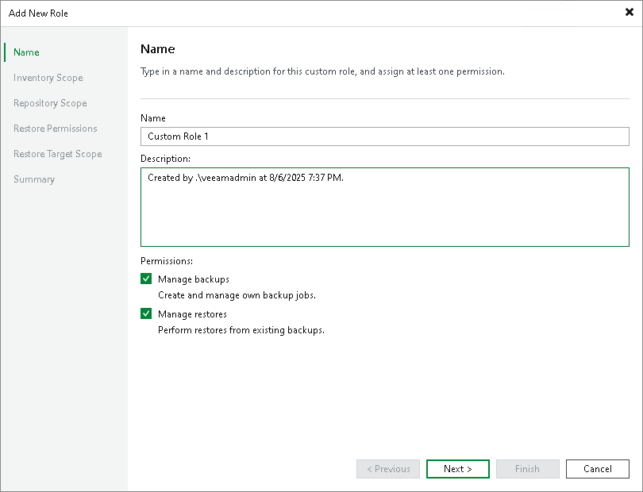

# Step 2. Specify Role Name and Description

At the Name step of the wizard, specify a name and description for the new custom role.

1. In the Name field, specify a name for the new role.
2. In the Description field, provide a description for future reference. The default description contains information about the user who added the role, date and time when the role was created.
3. Select which permissions to assign to this role:

* Manage backups — allows the user to create and manage their own backup jobs.

If you select this option, at the next steps you can configure granular access for the user with this role to the Veeam Backup & Replication installation inventory and repositories.

* Manage restores — allows the user to perform restores from existing backups.

If you select this option, at the next steps you can configure granular access for the user with this role to the Veeam Backup & Replication restore permissions and restore targets.

