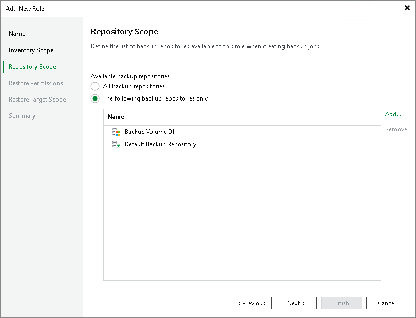

# Step 4. Define Repository Scope

At the Repository Scope step of the wizard, specify which backup repositories this role can use for creating backup jobs:

* All backup repositories — grants access to all repositories.
* The following backup repositories only — restricts access to selected repositories. Click Add to select specific repositories.

