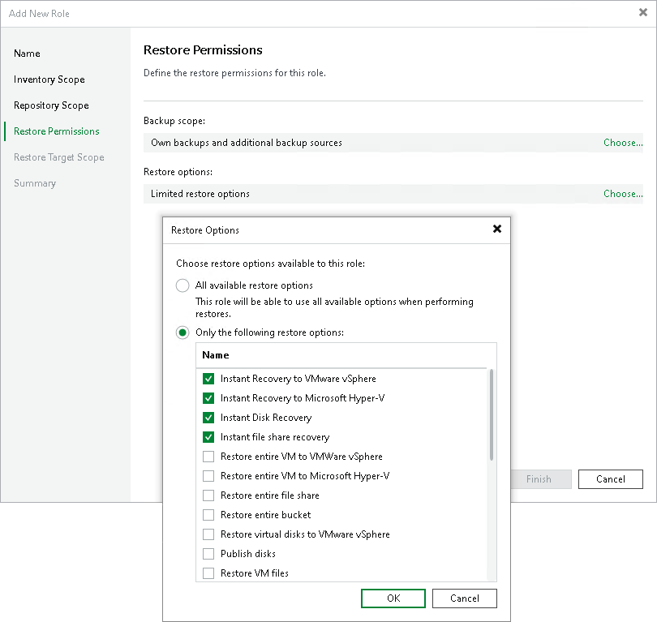

# Step 5. Configure Restore Permissions

In this article

At the Restore Permissions step of the wizard, define which backups and restore operations are available:

* Backup scope:

* All backups — allows restores from all available backups regardless of their ownership.
* Own backups only — restricts restores to backups created by users assigned to this role. You can additionally allow restoring backups from specific repositories. Click Add to select specific repositories.

* Restore options:

* All available restore options — grants access to all restore types.
* Only the following restore options — restricts access to selected restore operations (for example, Instant Recovery to VMware vSphere or Microsoft Hyper-V). Use check boxes in the list of restore options to specify the allowed restore types.

Page updated 8/6/2025

Page content applies to build 13.0.1.1071
