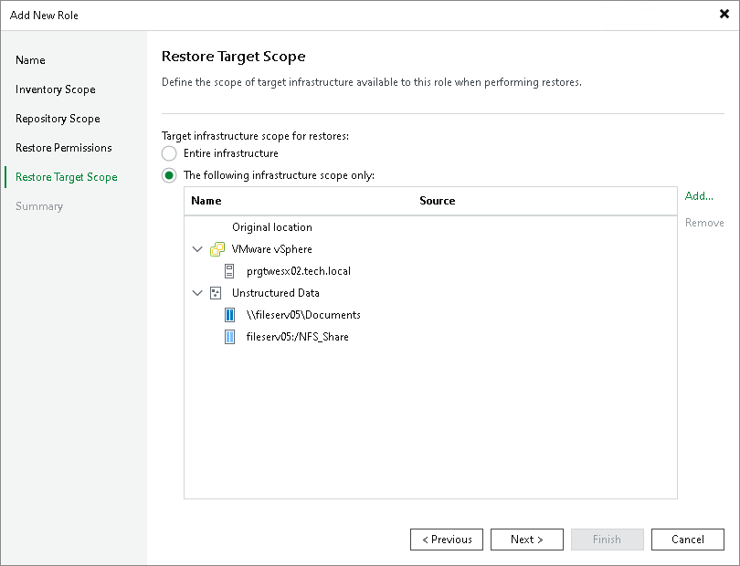

# Step 6. Define Restore Target Scope

At the Restore Target Scope step of the wizard, specify where users with this role can perform restores:

* Entire infrastructure — allows restores to any target in the infrastructure.
* The following infrastructure scope only — restricts restores to selected targets. Click Add to choose specific clusters, servers, file shares or other targets as allowed restore destinations.

