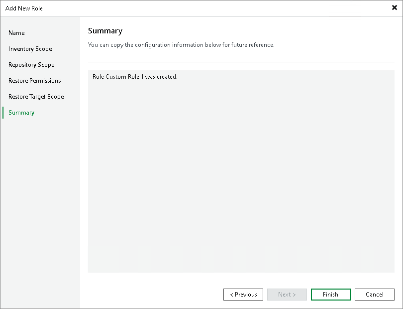

# Step 7. Finish Working with Wizard

In this article

At the Summary step of the wizard, review details of the added custom role and click Finish to exit the wizard.

|  |
| --- |
| Note |
| After you make changes to a role, all users assigned to this role must log out and log in again to the Veeam Backup & Replication console or Veeam Backup & Replication web UI for the changes to take effect. |

Page updated 8/12/2025

Page content applies to build 13.0.1.1071
