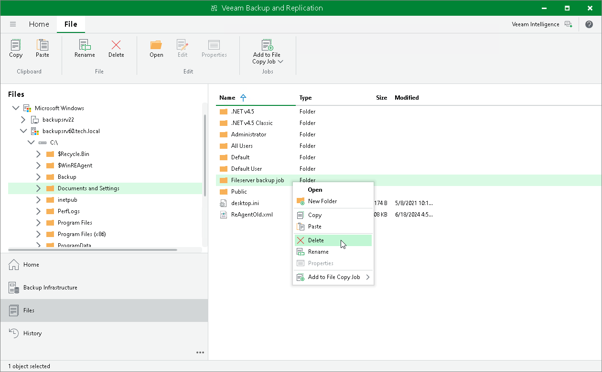

# Managing Folders

You can create, rename and delete folders in the Files view of Veeam Backup & Replication.

To create a folder:

1. Open the Files view.
2. In the inventory pane, expand the file tree of the necessary server or host.
3. In the working area, right-click anywhere on the blank area and select New Folder.

To rename a folder:

1. Open the Files view.
2. In the inventory pane, expand the file tree of the necessary server or host.
3. In the working area, select the folder and click Rename on the ribbon, or right-click the folder and select Rename.
4. Enter a new name for the folder and press [Enter] on the keyboard.

To remove a folder:

1. Open the Files view.
2. In the inventory pane, expand the file tree of the necessary server or host.
3. In the working area, select the folder and click Delete on the ribbon, or right-click the folder and select Delete.

