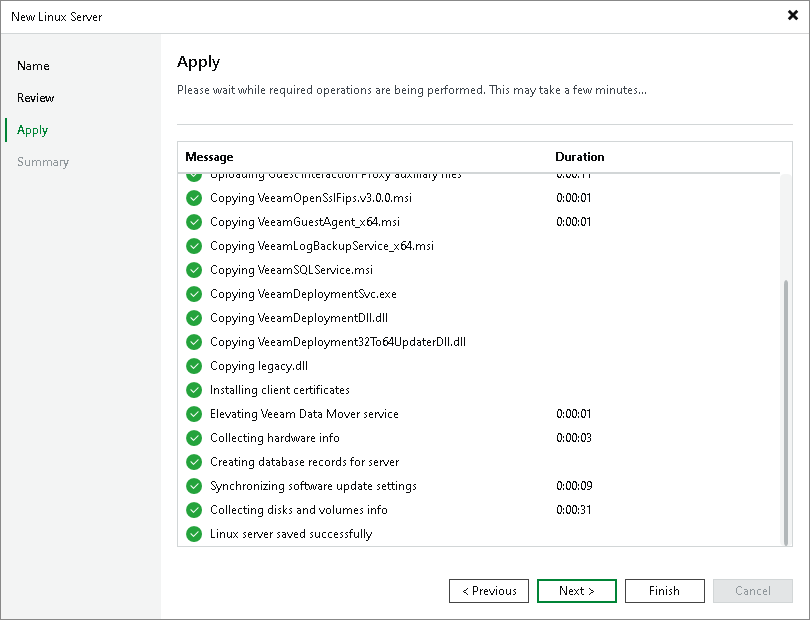

# Step 4. Apply Settings

In this article

At the Apply step of the wizard, wait till Veeam Backup & Replication installs and configures all the required components. Click Next to complete the adding of the server.

Page updated 11/3/2025

Page content applies to build 13.0.1.1071
