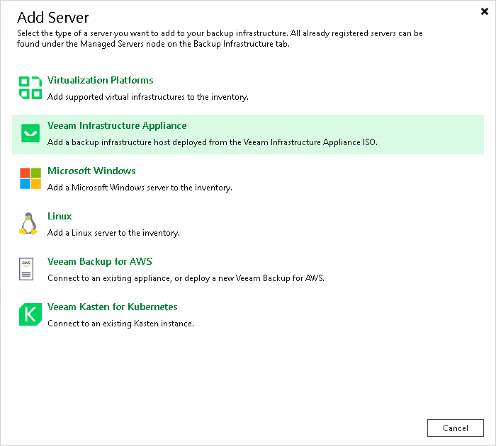

# Step 1. Launch New Linux Server Wizard

In this article

To launch the New Linux Server wizard, do the following:

1. Open the Backup Infrastructure view.
2. In the [inventory pane](vbr_ui.md), right-click the Managed Servers node and select Add Server. Alternatively, you can click Add Server on the ribbon.
3. In the Add Server window, select Veeam Infrastructure Appliance.

Page updated 10/31/2025

Page content applies to build 13.0.1.1071
