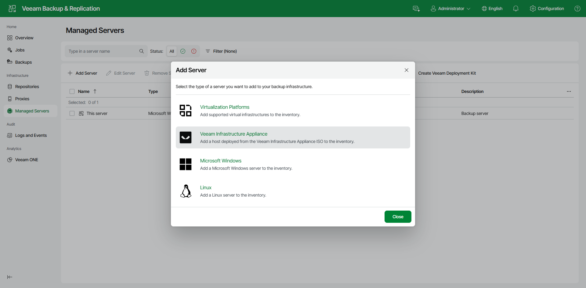

# Step 1. Launch New Linux Server Wizard

To launch the New Linux Server wizard, do the following:

1. In the management pane, click the Managed Servers node.
2. Click Add Server on the ribbon and select Veeam Infrastructure Appliance.

