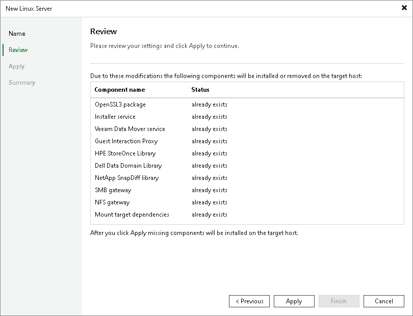

# Step 3. Review Components

At the Review step of the wizard, review what Veeam Backup & Replication components are already installed on the server and what components will be installed. Click Apply to add the Veeam Infrastructure Appliance to the backup infrastructure.

