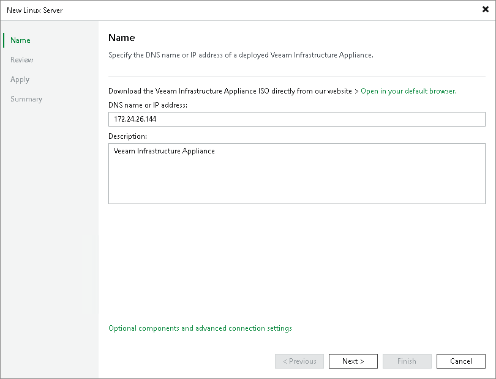
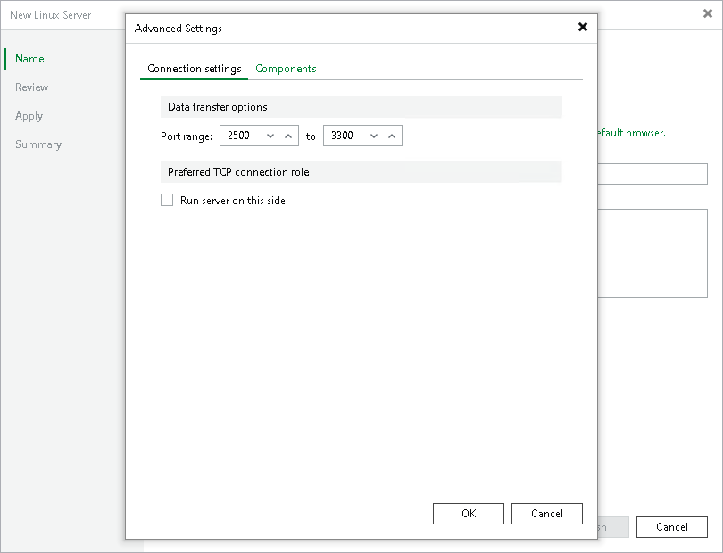
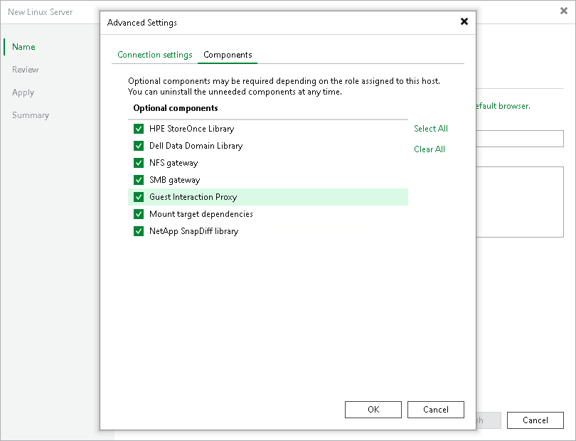
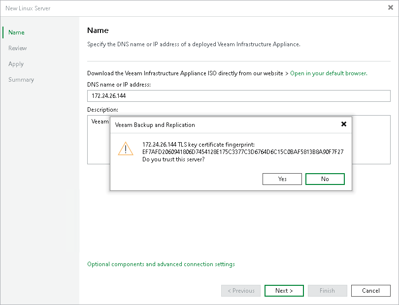

# Step 2. Specify Server Name or Address

At the Name step of the wizard, specify an address and description for the Veeam Infrastructure Appliance.

1. Enter a full DNS name, or IPv4 or IPv6 address of the host deployed from the Veeam Infrastructure Appliance ISO. Note that you can use IPv6 addresses only if IPv6 communication is enabled as described in section [IPv6 Support](ipv6.md).

If you do not have a host deployed from the Veeam Infrastructure Appliance ISO yet, click Open in your default browser to download the ISO file. For more information, see [Installing Veeam Infrastructure Appliance with ISO](linux_infrastructure_appliance_install.md).

1. Provide a description for future reference. The default description contains information about the user who added the server, the date and time when the server was added.

1. To configure connection settings and optional components, click Optional components and advanced connection settings. In the Advanced Settings window:

* On the Connection settings tab, you can specify the data transfer options:

1. In the Data transfer options section, specify connection settings for file copy operations. Provide a range of ports that will be used as transmission channels between the source host and the target host (one port per task). By default, Veeam Backup & Replication uses port range 2500-3300. If the virtual environment is not large and data traffic will not be significant, you can specify a smaller range of ports, for example, 2500-2509 to run 10 concurrent tasks at the same time.

Port 6162 is opened by default. It is a port used by [Veeam Data Mover](veeam_transport_service.md).

1. [For Veeam Infrastructure Appliance deployed outside NAT] In the Preferred TCP connection role section, select the Run server on this side check box. In the NAT scenario, the outside client cannot initiate a connection to the server on the NAT network. As a result, services that require initiation of the connection from outside can be disrupted. With this option selected, you can overcome this limitation and initiate a "client-server" connection — that is, a connection in the direction of the Veeam Infrastructure Appliance.

The option applies if one of the following roles is assigned to the server: source VMware backup proxy in backup or replication scenarios, or source repository in the backup copy scenario.

* On the Components tab, you can select the required components to be installed depending on the role you plan to assign to the Veeam Infrastructure Appliance in the backup infrastructure. Clear the check boxes of the components you do not need. By default, Veeam Backup & Replication installs all components from the list.

If you change the role of the Veeam Infrastructure Appliance, you can uninstall or reinstall the components later at the Name step of the Edit Server wizard.

|  |
| --- |
| Note |
| Depending on the selected components (possible roles), the Veeam Infrastructure Appliance may require additional packages that must be installed before you add the server to the backup infrastructure. For details, see the requirements for the role assigned. For example, see [Mount Server System Requirements](system_requirements.md#mount). |

1. When you add a Veeam Infrastructure Appliance, Veeam Backup & Replication saves a fingerprint of the TLS key certificate to the configuration database. During every subsequent connection to the server, Veeam Backup & Replication uses the saved fingerprint to verify the server identity and avoid the man-in-the-middle attack.

To let you identify the server, Veeam Backup & Replication displays the TLS key certificate fingerprint:

+ If you trust the server and want to connect to it, click Yes.
+ If you do not trust the server, click No. Veeam Backup & Replication will display an error message, and you will not be able to connect to the server.

