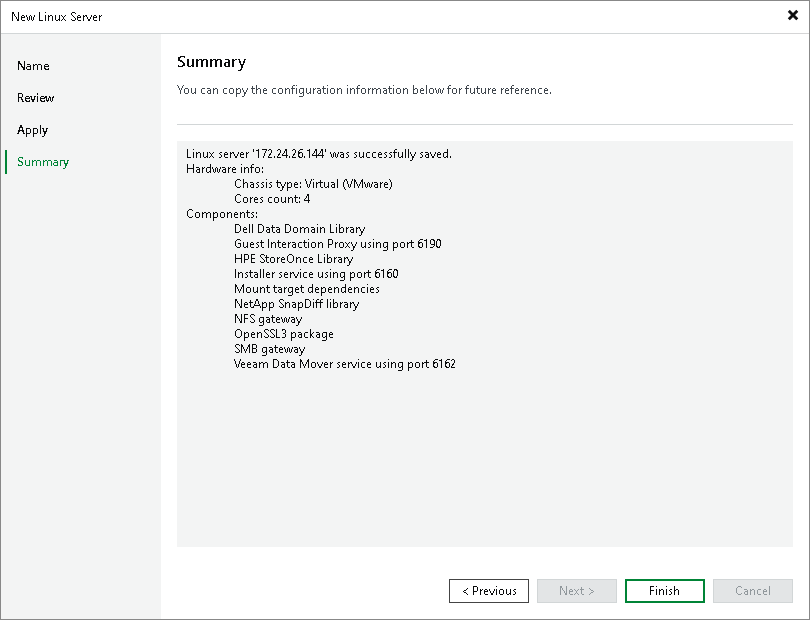

# Step 5. Finish Working with Wizard

In this article

At the Summary step of the wizard, complete the procedure of adding Veeam Infrastructure Appliance.

1. Review details of the Veeam Infrastructure Appliance.
2. Click Next, then click Finish to exit the wizard.

Page updated 11/3/2025

Page content applies to build 13.0.1.1071
