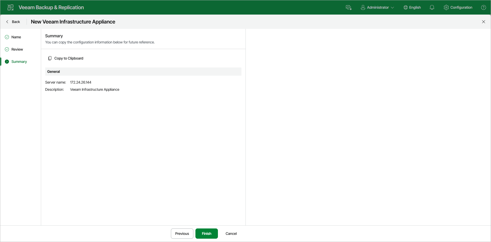

# Step 4. Finish Working with Wizard

In this article

At the Summary step of the wizard, review the details of the Veeam Infrastructure Appliance. Click Finish to add the Veeam Infrastructure Appliance to the backup infrastructure. Veeam Backup & Replication will install and configure all required components.

Page updated 11/3/2025

Page content applies to build 13.0.1.1071
