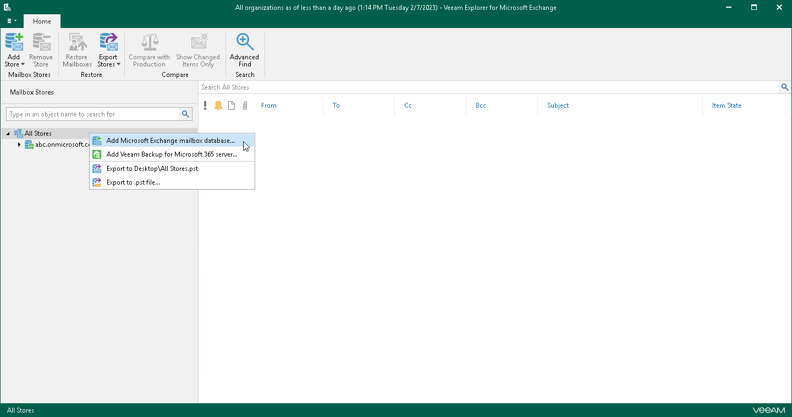

# Adding Microsoft Exchange Databases

You can add Microsoft Exchange databases to the application scope manually.

Veeam Explorer for Microsoft Exchange supports adding databases created with the following Microsoft Exchange versions:

* Microsoft Exchange Subscription Edition
* Microsoft Exchange Server 2019
* Microsoft Exchange Server 2016

|  |
| --- |
| Note |
| Consider the following:   * Before adding databases, make sure that Veeam Explorer for Microsoft Exchange has access to the ese.dll file. For more information, see [Extensible Storage Engine](vex_ese_config.md).  * If a database is in Dirty State, you will need to recover it by applying log files. Click Recover and wait until log files are applied, then re-add the database. Make sure that the Write permission is granted to the account being used.  * Make sure you have disabled the Veeam Backup Proxy for Microsoft Office 365 service when adding local databases. You can stop this service by using the services.msc console. If you try to add a database having this service still in progress, you will receive an error message and will not be able to access the database due to database lock. |

To manually add a Microsoft Exchange database, do the following:

1. Do one of the following:

* On the Home tab, click Add Store > Microsoft Exchange mailbox database on the ribbon.
* Right-click the All Stores node and select Add Microsoft Exchange mailbox database.

1. Click Browse to specify the path to the .edb or .adb file and Exchange logs folder.

