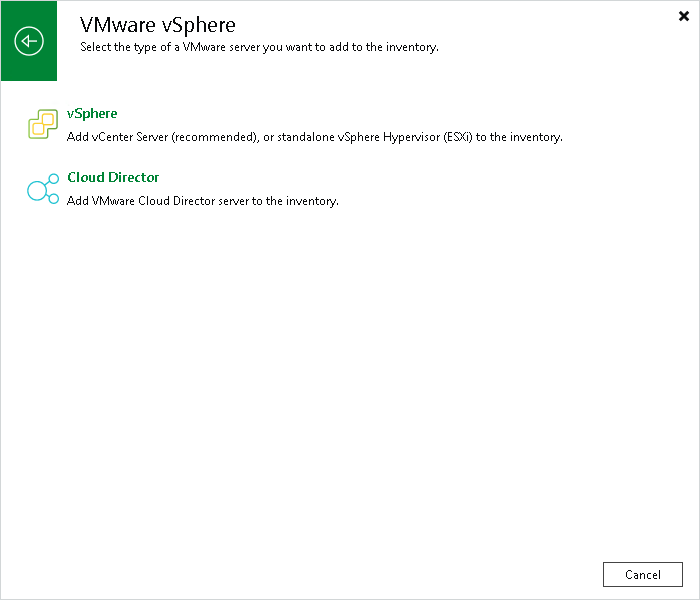

# Step 1. Launch New VMware Cloud Director Server Wizard

To launch the New VMware Cloud Director Server wizard, do the following:

1. Open the Backup Infrastructure view.
2. In the [inventory pane](vbr_ui.md), right-click the Managed Servers node and select Add Server. Alternatively, you can click Add Server on the ribbon.
3. In the Add Server window, click Virtualization Platforms > VMware vSphere > Cloud Director.

