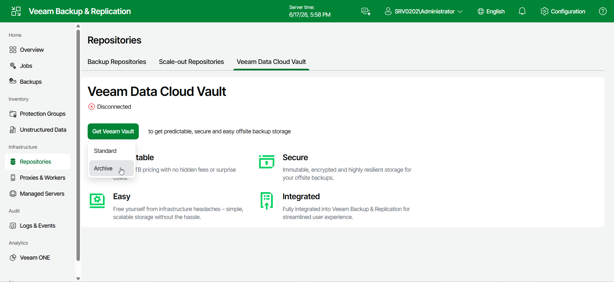

# Step 1. Launch New Veeam Data Cloud Vault Archive Wizard

To launch the New Veeam Data Cloud Vault Archive wizard do the following:

1. Open the Repositories node in the management pane.
2. Select the Veeam Data Cloud Vault tab.
3. Click Get Veeam Vault.
4. From the drops-down list, select Archive.

Page updated 2026-06-17

