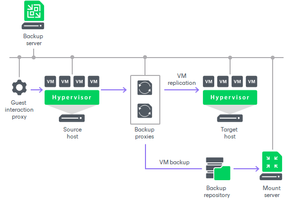

# Advanced Deployment

For mid-size and large-scale virtual environments with a large number of jobs, the load on the backup server is heavy. In this case, it is recommended that you use the advanced deployment scenario that moves the backup workload to dedicated backup infrastructure components. The backup server here functions as a "manager" for deploying and maintaining backup infrastructure components.

The advanced deployment includes the following components:

* Virtual infrastructure servers — virtualization hosts used as source and target for backup, replication and VM copy.
* Backup server — a configuration and control center of the backup infrastructure.
* VMware backup proxy and Hyper-V off-host backup proxy — “data mover” components used to retrieve VM data from the source datastore, process it and deliver to the target.

In Hyper-V environments, data processing is shifted from the Hyper-V server to an off-host backup proxy — a dedicated machine that is deployed on the source side, closer to the source Hyper-V host. The off-host backup proxy functions as a “data mover”, processing VM data and mediating the backup traffic from source to target. Therefore, the job processing overhead and data transport is offloaded from the source Hyper-V host.

* Backup repository — a location used to store backup files, VM copies and auxiliary replica files.

In the advanced deployment scenario, backup data is no longer stored to the backup repository on the backup server. Instead, data is transported to dedicated backup repositories. The backup server becomes a “manager” for off-host backup proxies and backup repositories.

* Dedicated mount servers — component required for VM guest OS files and application items restore to the original location.
* Dedicated guest interaction proxies — components used to deploy the non-persistent runtime components or persistent agent components in Microsoft Windows VMs.

With the advanced deployment scenario, you can easily meet your current and future data protection requirements. You can expand your backup infrastructure horizontally in a matter of minutes to match the amount of data you want to process and available network throughput. Instead of growing the number of backup servers or constantly tuning job scheduling, you can install multiple backup infrastructure components and distribute the backup workload among them. The installation process is fully automated, which simplifies deployment and maintenance of the backup infrastructure in your virtual environment.

In virtual environments with several proxies, Veeam Backup & Replication dynamically distributes backup traffic among these proxies. A job can be explicitly mapped to a specific proxy. Alternatively, you can let Veeam Backup & Replication choose the most suitable proxy. In this case, Veeam Backup & Replication will check settings of available proxies and select the most appropriate one for the job. The proxy server to be used should have access to the source and target hosts as well as to the backup repository to which files will be written.

The advanced deployment scenario can be a good choice for backing up and replicating off-site. You can deploy a backup proxy in the production site and another one in the disaster recovery (DR) site, closer to the backup repository. When a job is performed, backup proxies on both sides establish a stable connection, so this architecture also allows for efficient transport of data over a slow network connection or WAN.

To regulate backup load, you can specify the maximum number of concurrent tasks per proxy and set up throttling rules to limit proxy bandwidth. The maximum number of concurrent tasks can also be specified for a backup repository in addition to the value of the combined data rate for it.

Another advantage of the advanced deployment scenario is that it contributes to high availability — jobs can migrate between proxies if one of them becomes overloaded or unavailable.

Related Topics

[Backup Infrastructure Components](components.md)

[Simple Deployment](simple.md)

[Distributed Deployment](distributed.md)

